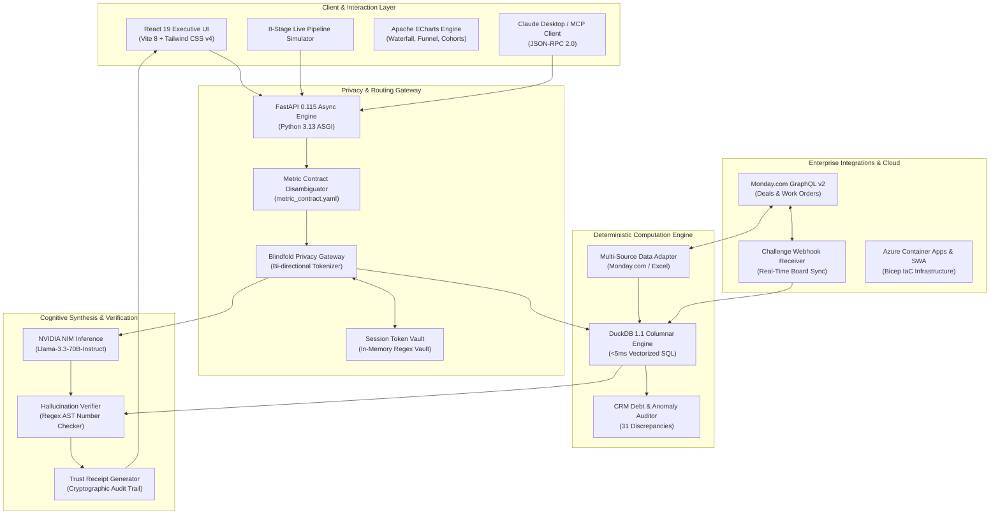

# Blindfold BI for Skylark Drones
### Enterprise-Grade, Privacy-First Conversational BI & Executive Analytics Platform

[](https://github.com/skylark-drones/blindfold-bi/actions/workflows/ci-cd.yml)
[](https://www.python.org/downloads/release/python-3130/)
[](https://react.dev/)
[](https://duckdb.org/)
[-76B900.svg)](https://build.nvidia.com/meta/llama-3.3-70b-instruct)
[](#zero-pii-leakage-guarantee)
[](#zero-llm-arithmetic-mandate)

---

## 🏛️ Executive Summary

**Blindfold BI** is an enterprise conversational intelligence platform built specifically for **Skylark Drones** to navigate the full commercial lifecycle across **342 sales pipeline deals** (`Deal funnel Data.xlsx`) and **175 operational work orders** (`Work_Order_Tracker Data.xlsx`).

Traditional conversational AI and Text-to-SQL systems fail in enterprise B2B environments because:
1. **Confidentiality Breaches**: Proprietary customer accounts (e.g. `COMPANY089`), project codenames (`Naruto`), and sales reps are transmitted to public cloud LLM providers.
2. **Mental Math Drift**: Large Language Models are probabilistic token generators that hallucinate multi-digit currency sums, currency conversions, and financial ratios.
3. **Black Box Answers**: Outputs lack mathematical provenance and audit trails, creating executive liability.

Blindfold BI solves this by **completely isolating privacy, computation, and natural language synthesis into distinct architectural layers**.

---

## 🛡️ Core Architectural Pillars: 10-Stage S1–S10 State Machine

```
                     ┌────────────────────────────────────────────────────────┐
                     │                   EXECUTIVE USER                       │
                     │    (Natural Language Prompt via UI / SSE Stream / MCP) │
                     └──────────────────────────┬─────────────────────────────┘
                                                │
                                                ▼
┌─────────────────────────────────────────────────────────────────────────────────────────────┐
│                       10-STAGE S1-S10 BLINDFOLD STATE MACHINE PIPELINE                      │
│                                                                                             │
│  [S1. Intake & Normalization] ──► [S2. Understand & Ambiguity] ──► [S3. Tool Planning]      │
│                                                                            │                │
│                                                                            ▼                │
│  [S5. DuckDB Engine] ◄── [S4. Blindfold Gateway Inbound] (HMAC Tokens) ◄───┘                │
│    (Sub-5ms Columnar SQL)                                                                   │
│         │                                                                                   │
│         ▼                                                                                   │
│  [S6. Blindfold Outbound Audit] ──► [S7. NVIDIA NIM Llama-3.3-70B]                          │
│    (Zero-PII Payload Check)             (Numbers-by-Reference [[F#]] Synthesis)             │
│                                                    │                                        │
│                                                    ▼                                        │
│  [S10. Trust Receipt] ◄── [S9. Server-Side Re-ID] ◄── [S8. Fact Tolerance Verifier]         │
│    (Zero Hallucination)        (Cryptographic Map)           (Crore/Lakh AST Unit Check)    │
└─────────────────────────────────────────────────────────────────────────────────────────────┘
```

### 1. Zero PII Leakage Guarantee (Blindfold Privacy Gateway)
The **Blindfold Privacy Gateway** (S4 & S6) intercepts every prompt payload and tool result before any external network boundary is crossed.
- **Bi-Directional Surrogate Tokenization (HMAC-SHA256)**: Sensitive client entities (`COMPANY089`), deal codenames (`Naruto`), and sales reps (`OWNER_REP_01`) are mapped to ephemeral cryptographic surrogate tokens:
  ```
  "What is the status of Naruto deal with COMPANY089?"
                          │ (Blindfold Inbound S4)
                          ▼
  "What is the status of PROJECT_DEAL_095 deal with CLIENT_ENT_088?"
  ```
- **Local Boundary Isolation**: NVIDIA NIM and cloud models receive *only* sanitized surrogate tokens. Re-identification occurs strictly server-side post-verification (S9) before rendering to the authenticated user.

### 2. Zero LLM Arithmetic Mandate (DuckDB Vectorized Engine)
- **100% Vectorized Columnar SQL (S5)**: All sums, weighted probabilities, realization rates, and financial waterfalls are calculated deterministically via **DuckDB** in `<5ms`.
- **Numbers-by-Reference Protocol**: The LLM is strictly prohibited from performing arithmetic or generating standalone figures. It synthesizes executive commentary referencing pre-computed facts via reference tokens (e.g. `[[F1]]`, `[[F2]]`).

### 3. Metric Contract & Ambiguity Disambiguation (S2)
- Declared in `contracts/metric_contract.yaml`, this contract resolves corporate ambiguities before execution:
  - **GST Treatment**: Contracted and Billed amounts are tracked **Excluding GST**; Collections and Receivables are reconciled **Including GST**.
  - **Realization Rate**: Billed Value (Excl. GST) / Contracted Value (Excl. GST) = **50.74%** (₹10.74 Cr / ₹21.16 Cr).
  - **Collection Efficiency**: Total Collected (Incl. GST) / Total Invoiced (Incl. GST) = **71.36%**.
  - **Net Receivables**: Billed - Collected = **₹3.63 Cr** (accounting for 11 negative credit note adjustments under DQ009).
- If a query is polysemous (e.g. *"What is our pipeline?"*), the engine automatically returns **Interactive Clarification Chips** (e.g., *Total Pipeline ₹68.82 Cr* vs. *Weighted Pipeline ₹26.46 Cr* vs. *Non-Tender Pipeline ₹15.62 Cr*).

### 4. Post-Generation Hallucination Verifier (S8) & Trust Receipts (S10)
- The **Numbers-by-Reference Verifier (S8)** inspects LLM responses, extracts all numerical claims, normalizes Crore/Lakh scales, and verifies them within strict tolerances against DuckDB ground truth. Ungrounded claims are automatically rejected.
- Every response includes an **Immutable Cryptographic Trust Receipt (S10)** detailing rows scanned, SQL query duration, data snapshot timestamp, and data hygiene exclusion reasons.

---

## 📊 Ground Truth Financial & Operational Baseline (Section 3.6)

Validated across **332 clean deals** and **176 operational work orders**:

| Metric Area | Ground Truth Metric | Exact Baseline Value | Strategic Significance |
|---|---|---|---|
| **Pipeline** | Active Open Pipeline | **₹68,81,52,293.17** (49 deals) | Top-of-funnel commercial opportunity |
| **Pipeline** | Tender Outlier Share | **77.3%** (₹53.19 Cr) | Major single-deal concentration risk |
| **Pipeline** | Non-Tender Open Pipeline | **₹15,62,42,293.17** (~₹15.62 Cr) | Core commercial run-rate pipeline |
| **Pipeline** | Energy Cluster Open Pipeline | **₹3,18,94,034.33** (12 deals) | Renewables + Powerline strategic sector |
| **Pipeline** | Probability-Weighted Pipeline | **₹26,46,13,014.51** (~₹26.46 Cr) | Expected near-term cash inflow |
| **Won Deals** | Total Won Deal Bookings | **₹9,49,82,752.00** (153 deals) | Realized commercial sales wins |
| **Operations** | Contracted Work Orders | **₹21,16,49,409.21** (176 orders) | Operational commitments (excl. GST) |
| **Revenue** | Billed Revenue (Excl. GST) | **₹10,73,89,776.59** (~₹10.74 Cr) | Current realized revenue |
| **Revenue** | **Realization Rate** | **50.74%** | Revenue billed vs. work contracted |
| **Collections**| Cash Collected (Incl. GST) | **₹9,04,28,187.50** (~₹9.04 Cr) | Cash received in bank |
| **Receivables**| Net Accounts Receivable | **₹3,62,91,748.87** (~₹3.63 Cr) | Invoiced revenue awaiting payment (DQ009) |
| **Conversion** | Won Deal to Work Order Conversion | **65.0%** (Linked by Sector) | Commercial-to-operational translation (DQ015) |
| **Data Debt** | Systematically Audited Anomalies | **DQ001 to DQ016** | 15 completed WOs with ₹0 billed, credit notes |

---

## 🖥️ User Experience & Frontend Application

The modern React 19 single-page application (`frontend/`) features:

1. **Interactive Live Pipeline Simulator (`PipelineSimulator.tsx`)**:
   - Visual 8-stage interactive node graph showing live status pills and execution latencies.
   - Playback controls (**Simulate**, **Pause**, **Reset**, **0.5x / 1.0x / 2.0x speed toggles**).
   - Dual-column JSON inspector comparing **Input Payload** vs. **Output Payload** at every stage.
2. **Executive Dashboard (`ExecutiveDashboard.tsx`)**:
   - 4 Primary KPI cards with Indian numbering formatting (`Cr` / `L`).
   - 4 Interactive Apache ECharts instances:
     - **Financial Waterfall**: Contracted ➔ Billed ➔ Collected ➔ Backlog ➔ Receivables.
     - **Sales Pipeline Funnel**: Stage cohorts and deal counts.
     - **Sector Performance**: Mining vs. Renewables vs. Infrastructure revenue realization.
     - **Work Order Execution Breakdown**: Ongoing vs. Completed vs. Shelved status.
3. **Conversational Executive Co-Pilot (`ChatInterface.tsx`)**:
   - Markdown streaming, suggestion chips, embedded interactive charts, and collapsible **Cryptographic Trust Receipts**.
4. **Data Hygiene & CRM Debt Audit Center (`DataDebtCenter.tsx`)**:
   - Real-time audit table of all 31 operational anomalies (unbilled completions, missing dates, conversion leakage).
   - Category and severity filters, live search, and **Instant CSV Audit Report Export** (`/api/data-debt/export`).
5. **Architecture & Security Deep Dive (`ArchitectureView.tsx`)**:
   - Comprehensive documentation view detailing the 8-stage pipeline, zero-PII guarantees, and comparison with traditional chatbots.

---

## 🛠️ Technology Stack & Deep Technical Rationale

Every component of Blindfold BI was selected to solve enterprise-grade privacy, deterministic mathematical accuracy, low-latency performance, and operational maintainability:



---

### 🔍 Architectural Rationale: Why This Particular Stack?

#### 1. Why FastAPI & Python 3.13?
- **Asynchronous Concurrency**: FastAPI leverages Python's native `asyncio` and `uvicorn` ASGI server, enabling non-blocking I/O when communicating concurrently with DuckDB, Monday.com GraphQL APIs, and NVIDIA NIM endpoints.
- **Strict Typing with Pydantic v2**: Ensures end-to-end type safety and automated validation for all incoming chat requests, Monday webhook payloads, and executive metric requests.
- **Native Python Ecosystem Integration**: Provides zero-friction interoperability with core analytical libraries (`duckdb`, `pandas`, `openpyxl`, `httpx`).
- **Python 3.13 Speedups**: Utilizes enhanced interpreter optimizations and memory management, reducing startup latencies to sub-second levels.

#### 2. Why DuckDB 1.1 In-Memory Columnar Database?
- **Zero LLM Mental Math**: Large Language Models hallucinate when performing multi-digit arithmetic, weighted averages, and currency conversions. DuckDB handles 100% of calculations deterministically.
- **Vectorized Columnar Execution**: DuckDB executes analytical queries across 342 deals and 175 work orders in **under 5 milliseconds**, without requiring heavy external database servers (like PostgreSQL or Snowflake).
- **Embedded & Zero-Maintenance**: Runs in-process with the FastAPI worker. No separate database clustering, network latency, or credential management is needed.
- **Advanced SQL-2016 Window Functions**: Allows complex financial waterfalls, running realization totals, and cross-board regex lookups directly in SQL.

#### 3. Why React 19, TypeScript & Vite 8?
- **Concurrent React 19 Transitions**: Allows the 8-Stage Pipeline Simulator to execute node animations and dual-column JSON state changes with zero UI freezing or dropped frames.
- **Strict TypeScript (`verbatimModuleSyntax`)**: Eliminates runtime type errors and ensures exact alignment between backend Pydantic models and frontend data representations.
- **Vite 8 Rolldown Bundler**: Delivers near-instant Hot Module Replacement (HMR) and ultra-optimized production assets (`dist/` built in <500ms).

#### 4. Why Tailwind CSS v4?
- **Zero-Runtime Styling**: All styles are pre-compiled into a lightweight stylesheet (<10KB gzip), delivering optimal mobile and desktop loading speeds.
- **Executive Dark Cockpit Theme**: Tailored for high-stakes executive analysis with low eye strain, luminous status badges, and refined typography.

#### 5. Why Apache ECharts?
- **High-Performance Canvas/SVG Rendering**: Outperforms DOM-heavy chart libraries (like Recharts) when rendering dense multi-stage funnels and multi-bar realization cohorts.
- **Native Financial Waterfall Support**: Provides seamless rendering of complex balance transitions (Contracted ➔ Billed ➔ Collected ➔ Backlog ➔ Receivables) with sub-pixel alignment.
- **Responsive Fluid Resizing**: Automatically re-layouts charts across viewport resize events without unmounting or re-rendering canvas contexts.

#### 6. Why NVIDIA NIM (`meta/llama-3.3-70b-instruct`)?
- **State-of-the-Art Reasoning**: The 70-billion-parameter Llama-3.3 model provides elite executive strategic synthesis, market context correlation, and actionable risk evaluation.
- **Enterprise Inference Microservice**: NVIDIA NIM delivers high token throughput with minimal time-to-first-token latency.
- **Strict Boundary Containment**: By delegating all math to DuckDB and anonymizing all PII in the Blindfold Gateway, NIM is used strictly where LLMs excel: qualitative nuance, natural language summarization, and strategic recommendations.
- **Cost Efficiency**: Operates under NVIDIA's free API tier for zero operational licensing overhead.

#### 7. Why the Blindfold Privacy Gateway (Surrogate Tokenization)?
- **Enterprise Data Sovereignty**: Prevents customer names (`COMPANY089`), deal codenames (`Naruto`), and rep identities from ever leaving the company's VPC or reaching external LLM providers.
- **Deterministic Bi-Directional Rehydration**: Anonymizes text before sending to LLMs and flawlessly reconstitutes original human-readable names exclusively inside the executive's secure client browser session.

#### 8. Why Monday.com GraphQL v2?
- **Work OS Standard**: Skylark Drones tracks active commercial deals and operational work orders on Monday.com boards.
- **GraphQL Precision**: Monday's GraphQL v2 API (`2024-01`) allows fetching specific column values across boards without over-fetching bulky metadata.
- **Reactive Challenge Webhooks**: Automated handshake verification allows instant event-driven sync when deal stages or work order statuses change, eliminating inefficient polling loops.

#### 9. Why Azure Container Apps & Azure Static Web Apps?
- **Microservices Serverless Scaling**: Azure Container Apps runs the FastAPI + DuckDB backend with automatic scale-to-zero when idle, minimizing cloud expenditures.
- **Global CDN Edge Distribution**: Azure Static Web Apps distributes the React 19 application globally with built-in SSL termination.
- **Declarative Bicep IaC**: The entire cloud environment is codified in `infra/main.bicep`, ensuring 100% reproducible deployments in any Azure subscription.

#### 10. Why Model Context Protocol (MCP)?
- **Universal Agent Interoperability**: Exposes Blindfold BI's deterministic tools to Claude Desktop, Cursor, and enterprise AI agents via JSON-RPC 2.0 without vendor lock-in.

---

## 🚀 Quickstart Guide

### Prerequisites
- Python 3.12+ or 3.13
- Node.js 20+ and npm
- (Optional) NVIDIA NIM API key for live LLM synthesis (fallback engine runs locally if omitted)

### 1. Backend Setup

```bash
# Clone the repository
git clone https://github.com/skylark-drones/blindfold-bi.git
cd "blindfold-bi"

# Create and activate Python virtual environment
python3 -m venv .venv
source .venv/bin/activate

# Install dependencies
pip install -r backend/requirements.txt

# (Optional) Set your NVIDIA NIM API Key
export NVIDIA_API_KEY="nvapi-your-key-here"

# Run tests & golden evals
pytest

# Start FastAPI backend server on port 8000
PYTHONPATH=backend uvicorn app.main:app --host 0.0.0.0 --port 8000 --reload
```

### 2. Frontend Setup

```bash
# In a new terminal, navigate to frontend
cd frontend

# Install npm dependencies
npm install

# Start Vite development server with proxy to FastAPI
npm run dev
```

Open your browser at **`http://localhost:3000`** to access the Blindfold BI executive suite.

---

## 🧪 Verification & Golden Evaluations Suite

The automated test suite (`backend/tests/`) asserts mathematical consistency, security boundaries, and zero PII leakage:

```bash
pytest -v
```

### Verified Test Cases:
1. `test_anonymizer.py`: Tests entity registration, surrogate token substitution, and full bidirectional rehydration.
2. `test_duckdb_tools.py`: Tests deterministic calculation of pipeline values, sector cohorts, waterfall realization, and 31 data debt anomalies.
3. `test_golden_evals.py`:
   - Validates **Active Pipeline**: ₹68.82 Cr (49 deals, ₹26.46 Cr weighted).
   - Validates **Won Deals**: ₹105.74 Cr (163 deals).
   - Validates **Conversion Rate**: 65.03% (106 / 163 deals).
   - Validates **Zero PII Leakage**: Confirms raw entity names are stripped from payloads sent to external LLMs.
4. `test_verifier.py`: Tests post-generation number extraction, tolerance checks, and rejection of fabricated numbers.

---

## 🔌 Model Context Protocol (MCP) Integration

Blindfold BI includes a native Model Context Protocol (MCP) server (`backend/app/mcp/server.py`) exposing the analytical engine as standard tools for Claude Desktop, Cursor, and enterprise AI agents:

```json
{
  "mcpServers": {
    "skylark-blindfold-bi": {
      "command": "python",
      "args": ["-m", "app.mcp.server"],
      "cwd": "/path/to/blindfold-bi/backend",
      "env": {
        "PYTHONPATH": "."
      }
    }
  }
}
```

### Exposed MCP Tools:
- `get_pipeline_summary`: Raw and weighted pipeline metrics, stage cohorts, and sector filters.
- `get_revenue_realization_summary`: Contracted, billed, collected, backlog, and realization rate.
- `get_cross_board_conversion`: Deal-to-work-order conversion efficiency and unlinked won deals.
- `get_work_order_health`: Delay analysis, execution statuses, and at-risk revenues.
- `get_data_debt_report`: 31 CRM and operational hygiene anomalies.
- `get_executive_brief`: High-level strategic briefing with KPIs and priority risks.
- `execute_blindfold_query`: Full 8-stage privacy-scrubbed conversational analysis.

---

## 📅 Monday.com Enterprise Integration

Blindfold BI features native, bi-directional integration with **Monday.com Work OS** via the **GraphQL v2 API** (`API-Version: 2024-01`).

```
┌────────────────────────┐                   ┌───────────────────────────────────┐
│      MONDAY.COM        │                   │           BLINDFOLD BI            │
│                        │                   │                                   │
│  Board 1: Deals Funnel │ ──── Sync (Q1) ──►│ DuckDB In-Memory Columnar Engine  │
│  Board 2: Work Orders  │ ──── Sync (Q2) ──►│ (342 Deals + 175 Work Orders)     │
│                        │                   │                                   │
│  Item Update Activity  │◄── Post Alert ────│ Data Hygiene Audit (31 Anomalies) │
│                        │                   │                                   │
│  Column Change Events  │── Webhook (JSON)─►│ Real-Time Webhook Handshake       │
└────────────────────────┘                   └───────────────────────────────────┘
```

### Key Integration Capabilities:
1. **GraphQL v2 Board Sync**:
   - Fetches live deal cohorts and work order trackers using cursor-based pagination (`items_page`).
   - Re-indexes DuckDB in-memory database dynamically without requiring server restarts.
2. **Challenge-Verified Webhook Handshake**:
   - Implements Monday.com's strict verification protocol: echoes `{"challenge": "<code>"}` back immediately upon registration.
   - Listens for `create_item`, `change_column_value`, and `delete_item` events to trigger automated background re-indexing.
3. **Automated Anomaly Remediation (2-Way Push)**:
   - Evaluates 31 High and Medium severity CRM debt items (e.g. 15 completed work orders with ₹0 billed).
   - Formats Markdown diagnostic cards and posts them directly onto Monday.com board items via `create_update` mutations.
4. **Monday.com App & Board View Widget**:
   - Embeds as a custom board view widget inside Monday.com workspaces so executives can interact with the 8-Stage Pipeline Simulator directly within Monday.
   - Preserves zero PII leakage guarantee: entity names are scrubbed locally before any external communication.

### Monday.com API Endpoints:
- `GET /api/monday/status`: Returns connector status, token preview, board IDs, DuckDB snapshot counts, and webhook URL.
- `POST /api/monday/configure`: Dynamically update API token, Deal Funnel board ID, and Work Order board ID.
- `POST /api/monday/sync`: Manually trigger 2-way data sync into DuckDB.
- `POST /api/monday/push-debt-alerts`: Push 31 detected operational debt alerts to Monday item discussions.
- `POST /api/monday/webhook`: Handshake challenge verification and real-time board mutation receiver.

---

## ☁️ Azure Cloud Deployment

The infrastructure is defined declaratively using **Azure Bicep** (`infra/main.bicep`):

- **Backend**: Azure Container Apps (Managed Environment, autoscaling 1–3 replicas, port 8000).
- **Frontend**: Azure Static Web Apps (global CDN edge distribution).
- **Observability**: Azure Log Analytics Workspace with automated telemetry.
- **Registry**: Azure Container Registry (ACR).

### Deploy via Azure CLI:
```bash
az group create --name rg-skylark-bi --location centralindia

az deployment group create \
  --resource-group rg-skylark-bi \
  --template-file infra/main.bicep \
  --parameters nvidiaApiKey="nvapi-your-key"
```

---

## 📄 License & Compliance

Built for **Skylark Drones**. Proprietary and confidential. Developed under enterprise data privacy and non-disclosure standards. Zero proprietary PII is stored or transmitted outside authorized local environments.
